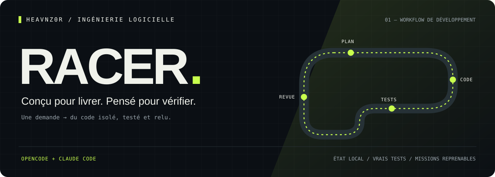

<p align="center"><a href="README.md">English</a> · <strong>Français</strong></p>

<p align="center"></p>

<p align="center">
  <a href="https://github.com/heavnzor/heavnz0r-racer/actions/workflows/ci.yml"></a>
  
  <a href="LICENSE"></a>
  
</p>

<p align="center"><strong>Un agent peut écrire le correctif. Racer permet de reprendre le travail, de le faire relire et de le relier à des vérifications réellement exécutées.</strong></p>

<p align="center"><a href="#démarrage-rapide">Démarrage rapide</a> · <a href="#le-cycle-dune-mission">Workflow</a> · <a href="docs/architecture.md">Architecture — EN</a> · <a href="evals/README.md">Vérifications — EN</a></p>

---

## À quoi sert Racer ?

Confiez à **OpenCode ou Claude Code** un bug, une refactorisation ciblée ou une branche à relire. Racer crée un *worktree* Git — un répertoire de travail isolé —, enregistre un plan exécutable, lance les vérifications choisies et associe la revue à l’ensemble exact des modifications testées, appelé *diff*.

Si la session s’arrête, vous pouvez reprendre la mission. Si le diff change après les tests, les vérifications précédentes deviennent obsolètes. Si les contrôles échouent, le workflow ne peut pas produire une livraison validée.

| Fonctionnalité | Fonctionnement concret |
|---|---|
| **Travail isolé** | Une nouvelle branche `racer/r-…` et son worktree ; votre répertoire de travail habituel est préservé. |
| **Critères d’acceptation exécutables** | Chaque critère référence une commande nommée, ses arguments et un délai maximal d’exécution. |
| **Revue indépendante** | Le client délègue la revue à un nouvel agent, dont le verdict et les observations localisées sont enregistrés séparément. |
| **Vérifications à jour** | Une empreinte SHA-256 couvre le diff, y compris les nouveaux fichiers non suivis par Git. |
| **Reprise après interruption** | Transactions SQLite, contrôle des révisions, journal d’événements et commande `resume`. |
| **Dossier de livraison** | `change.patch`, `report.md` et `receipt.json` ; publication facultative et explicite d’une pull request en brouillon. |

## Démarrage rapide

Prérequis : **Node 24+** et Git. GitHub CLI est nécessaire uniquement pour la commande `publish`.

```bash
git clone https://github.com/heavnzor/heavnz0r-racer.git
cd heavnz0r-racer
npm ci
npm run build
node dist/cli.js demo
```

La démo hors ligne crée `.racer-demo/`, reproduit une erreur de calcul de panier, la corrige, exécute de vrais tests Node et exporte un dossier de livraison. Les rôles sont pilotés par un scénario automatisé : **cette démo ne mesure pas la qualité d’un modèle**. Pour la relancer, fournissez un nouveau chemin avec `--output`.

<p align="center"><br><sub>Sortie réelle de la démo, en anglais ; lecture ralentie pour faciliter la compréhension.</sub></p>

La sortie ci-dessous montre le test en échec (**RED**), la correction validée (**GREEN**) puis le dossier de preuves (**RECEIPT**). Le tableau de bord **Pitwall** affiche la progression de la mission.

```text
01 / RED       quantity regression reproduced (1200 ≠ 2400)
02 / GREEN     regression + empty-cart checks passed
03 / RECEIPT   patch + check results + review bound to a SHA-256 diff

  HEAVNZ0R'RACER / PITWALL
  recon → plan → build → verify → review → handoff → [ DONE ]
  Attempts   2/3
  Evidence   verified
```

### OpenCode

Depuis le répertoire de Racer, en remplaçant le chemin d’exemple par celui de votre projet :

```bash
node dist/cli.js install-opencode --repo /absolute/path/to/your-project
```

Cette commande installe la commande `/racer`, une *skill* — les instructions du workflow —, quatre agents et une configuration MCP locale dans le dossier `.opencode/` de votre projet. Les autres réglages sont conservés ; l’installation refuse d’écraser des fichiers personnalisés incompatibles. Les chemins des exécutables générés sont propres à votre machine.

**Quittez puis redémarrez OpenCode**, ouvrez votre projet et lancez :

```text
/racer Corrige la pagination lorsque la dernière page est vide
```

### Claude Code

Après compilation de Racer, démarrez Claude Code dans votre projet avec le plugin local :

```bash
claude --plugin-dir /absolute/path/to/heavnz0r-racer
```

```text
/racer:drive Corrige la pagination lorsque la dernière page est vide
```

Le plugin utilise le modèle et les identifiants déjà configurés dans Claude Code. Aucun compte Racer ni aucune clé d’API de modèle supplémentaire n’est nécessaire. Le plugin local doit être compilé avant son chargement ; une installation distante depuis les seules sources ne contient pas le serveur compilé.

## Le cycle d’une mission


**Scout** repère le comportement dans le code. **Test writer** le reproduit par des tests. **Builder** réalise la modification dans le périmètre accepté. **Reviewer** examine le résultat de façon critique. Le client coordonne ces rôles ; le moteur de Racer contrôle les transitions entre les étapes.

Les corrections et refactorisations partent de `HEAD` ou de la référence fournie avec `--base`. Une revue de branche exige un répertoire propre, des modifications déjà commitées et une base explicite, par exemple `main`. Les commandes de vérification s’exécutent dans le nouveau worktree : installez-y au préalable les dépendances ignorées par Git.

## Ligne de commande et contrats de vérification

Pour les commandes suivantes, utilisez `node /path/to/racer/dist/cli.js`, ou exécutez `npm link` pour rendre `racer` disponible dans votre terminal.

```bash
racer start "Corriger la pagination des pages vides" --repo /path/to/project
racer plan r-12345678 --repo /path/to/project --file plan.json
racer begin r-12345678 --repo /path/to/project
racer verify r-12345678 --repo /path/to/project
racer review r-12345678 --repo /path/to/project --file review.json
racer handoff r-12345678 --repo /path/to/project
racer resume r-12345678 --repo /path/to/project
racer publish r-12345678 --repo /path/to/project --confirm
```

`--json` produit une sortie exploitable par d’autres programmes. `--revision N` vérifie que l’état n’a pas changé avant une écriture, comme le font les outils MCP. Une commande `verify` en échec renvoie un code de sortie non nul.

Exemple de plan :

```json
{
  "summary": "Gérer la dernière page vide sans modifier le contrat de pagination.",
  "scope": ["src/pagination.ts", "tests/pagination.test.ts"],
  "criteria": [{ "description": "Les pages vides renvoient un curseur valide", "checks": ["pagination"] }],
  "checks": [{ "id": "pagination", "command": ["npm", "test", "--", "pagination"], "timeoutMs": 30000 }],
  "evidence": [{ "path": "src/pagination.ts", "line": 42, "note": "Le curseur lit le dernier élément sans traiter le cas d’une page vide." }]
}
```

Les chemins désignent des fichiers précis ou des préfixes de répertoires, sans caractères génériques. Chaque élément de preuve doit pointer vers un fichier et une ligne existants dans le worktree de la mission. Adaptez les noms de fichiers et les commandes de cet exemple à votre projet.

Une revue a la forme `{ "reviewer": "…", "verdict": "pass", "summary": "…", "findings": [] }`. Le verdict `changes_requested` exige des observations comportant les champs `path`, `line` et `note`.

## Périmètre et limites

- **La v0.1 fonctionne sur un seul dépôt, en local, sous macOS ou Linux.** Le contenu interne des sous-modules et la publication de dépendances entre plusieurs dépôts ne sont pas couverts.
- **Les rôles séparent les responsabilités du workflow ; ils ne constituent pas un bac à sable.** Les permissions du client régissent les outils des agents. L’identité du relecteur et l’acceptation du plan sont déclarées par le client, sans attestation authentifiée.
- **Les vérifications exécutent le code du projet** dans l’environnement courant. Utilisez des projets de confiance et des commandes pertinentes : un code de sortie nul ne suffit pas à garantir la correction complète d’un programme.
- **Trois tentatives de vérification par défaut**, configurables jusqu’à dix. Une mission bloquée conserve ses résultats. Les suites longues peuvent nécessiter la ligne de commande, car les délais MCP varient selon le client.
- **Le nettoyage est manuel.** L’état, les rapports et les worktrees restent dans le dossier `racer/` du répertoire Git commun. Inspectez-les avant de supprimer un worktree avec Git.
- **La publication est explicite et propre à GitHub.** Elle crée un commit sur la branche de mission, vérifie que les hooks n’ont pas changé le diff, pousse vers `origin` et ouvre une PR en brouillon vers la branche par défaut de GitHub. Vérifiez la branche cible avant publication. La PR n’est pas fusionnée automatiquement.
- Le journal conserve localement les sorties des commandes et les chemins. Inspectez un rapport exporté avant de le partager.

## Développement

```bash
npm ci
npm run check
npm test
claude plugin validate .   # Facultatif, si Claude Code est installé
```

Les tests utilisent de vrais worktrees Git et couvrent les régressions, les vérifications devenues obsolètes, les modifications hors périmètre, les délais dépassés, la reprise, les conflits d’installation et la connexion MCP sur l’entrée/sortie standard. Les [notes de vérification — EN](evals/README.md) distinguent les tests du moteur des évaluations de modèles en conditions réelles.

<p align="center"><strong>Construisez avec Racer · Éprouvez vos hypothèses avec <a href="https://github.com/heavnzor/heavnz0r-crashlab/blob/main/README.fr.md">CrashLab</a> · Expliquez vos données avec <a href="https://github.com/heavnzor/heavnz0r-proofmill/blob/main/README.fr.md">ProofMill</a></strong></p>
