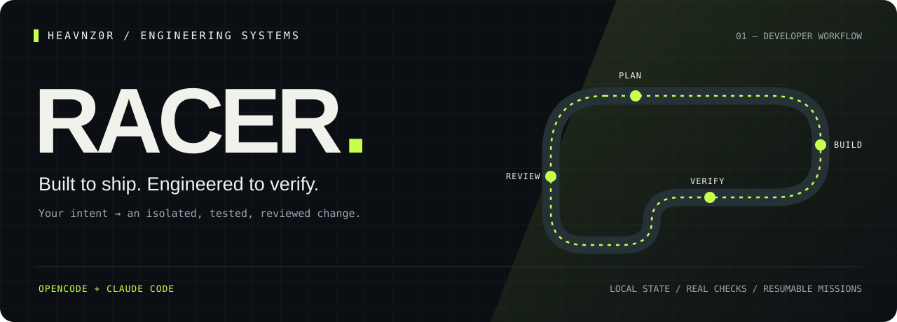
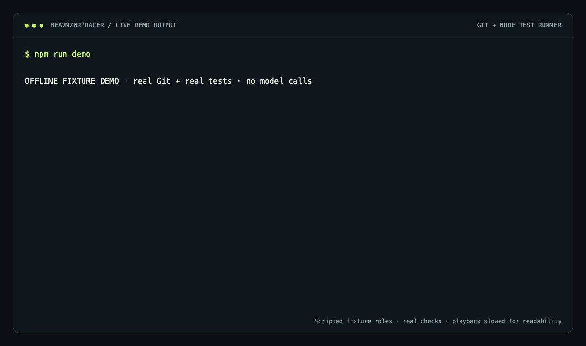
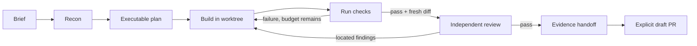

<p align="center"></p>

<p align="center">
  <a href="https://github.com/heavnzor/heavnz0r-racer/actions/workflows/ci.yml"></a>
  
  <a href="LICENSE"></a>
  
</p>

<p align="center"><strong>An agent can write the patch. Racer makes the work resumable, reviewable, and tied to actual checks.</strong></p>

<p align="center"><a href="#start-your-engine">Quickstart</a> · <a href="#the-mission-loop">Workflow</a> · <a href="docs/architecture.md">Architecture</a> · <a href="evals/README.md">Verification</a></p>

---

## The useful part

Give **OpenCode or Claude Code** a bug, a targeted refactor, or a branch to review. Racer creates a Git worktree, records an executable plan, runs the chosen checks, and binds the review to the exact diff that was tested.

If the session ends, resume the mission. If the diff changes after testing, its evidence becomes stale. If the checks fail, the workflow cannot produce a successful handoff.

| Capability | What actually happens |
|---|---|
| **Isolated work** | A fresh `racer/r-…` branch and worktree; your existing checkout is preserved. |
| **Executable acceptance criteria** | Each criterion references a named command, with argv and a timeout. |
| **Independent challenge** | The client delegates a fresh reviewer, whose located verdict is recorded separately. |
| **Evidence freshness** | A SHA-256 fingerprint covers the diff, including untracked additions. |
| **Crash recovery** | SQLite transactions, revision checks, an event journal, and `resume`. |
| **A real handoff** | `change.patch`, `report.md`, and `receipt.json`; optional explicit draft-PR publication. |

## Start your engine

Requires **Node 24+** and Git. GitHub CLI is needed only for `publish`.

```bash
git clone https://github.com/heavnzor/heavnz0r-racer.git
cd heavnz0r-racer
npm ci
npm run build
node dist/cli.js demo
```

The offline demo creates `.racer-demo/`, reproduces a cart-total bug, fixes it, runs real Node tests, and exports a handoff. It uses scripted fixture roles, **not a model evaluation**. A repeated demo needs a fresh `--output` path.

<p align="center"><br><sub>Recorded from the real demo engine; playback slowed for readability.</sub></p>

```text
01 / RED       quantity regression reproduced (1200 ≠ 2400)
02 / GREEN     regression + empty-cart checks passed
03 / RECEIPT   patch + check results + review bound to a SHA-256 diff

  HEAVNZ0R'RACER / PITWALL
  recon → plan → build → verify → review → handoff → [ DONE ]
  Attempts   2/3
  Evidence   verified
```

### OpenCode

From the Racer checkout:

```bash
node dist/cli.js install-opencode --repo /absolute/path/to/your-project
```

This installs the `/racer` command, skill, four agents, and a local MCP configuration under your project's `.opencode/`. It preserves unrelated configuration and refuses conflicting custom files. The generated executable paths are machine-local.

**Quit and restart OpenCode**, open your project, then:

```text
/racer Fix the pagination boundary when the last page is empty
```

### Claude Code

After building Racer, start Claude Code in your project with the local plugin:

```bash
claude --plugin-dir /absolute/path/to/heavnz0r-racer
```

```text
/racer:drive Fix the pagination boundary when the last page is empty
```

The plugin uses the model and credentials configured in Claude Code. No separate Racer account or model API key is required. The local plugin must be built before loading; a bare remote plugin installation does not include the compiled server.

## The mission loop



**Scout** locates the behavior. **Test writer** reproduces it. **Builder** implements the scoped change. **Reviewer** challenges the result. The client coordinates those roles; Racer's engine controls the state transitions.

Bug fixes and refactors start from `HEAD` or a supplied `--base`. Branch reviews need a clean, committed branch and an explicit base such as `main`. Check commands run in the new worktree, so install ignored dependencies there first.

## CLI and evidence contracts

Use `node /path/to/racer/dist/cli.js` below, or run `npm link` to make `racer` available in your shell.

```bash
racer start "Fix empty-page pagination" --repo /path/to/project
racer plan r-12345678 --repo /path/to/project --file plan.json
racer begin r-12345678 --repo /path/to/project
racer verify r-12345678 --repo /path/to/project
racer review r-12345678 --repo /path/to/project --file review.json
racer handoff r-12345678 --repo /path/to/project
racer resume r-12345678 --repo /path/to/project
racer publish r-12345678 --repo /path/to/project --confirm
```

`--json` provides machine-readable output. `--revision N` makes CLI writes optimistic, just like the MCP tools. A failed `verify` exits nonzero.

Example plan:

```json
{
  "summary": "Handle the empty last page without changing the pagination contract.",
  "scope": ["src/pagination.ts", "tests/pagination.test.ts"],
  "criteria": [{ "description": "Empty pages return a valid cursor", "checks": ["pagination"] }],
  "checks": [{ "id": "pagination", "command": ["npm", "test", "--", "pagination"], "timeoutMs": 30000 }],
  "evidence": [{ "path": "src/pagination.ts", "line": 42, "note": "The cursor reads the last item without handling an empty page." }]
}
```

Paths are literal files or directory prefixes, not globs. Evidence must resolve to a real file and line inside the mission worktree. Example filenames and commands must be adapted to your project.

A review is `{ "reviewer": "…", "verdict": "pass", "summary": "…", "findings": [] }`. A `changes_requested` verdict requires findings with `path`, `line`, and `note`.

## Operational boundaries

- **v0.1 is single-repository, local-first, macOS/Linux.** Submodule internals and multi-repo dependency publication are not covered.
- **Roles are workflow separation, not a sandbox.** The client's permissions govern agent tools. Reviewer identity and plan acceptance are client-reported, not authenticated attestations.
- **Checks execute project code** with the current environment. Use trusted projects and meaningful commands; exit zero alone cannot establish complete correctness.
- **Three verification attempts by default**, configurable up to ten. A blocked mission retains its evidence. Long suites may need the CLI because client MCP timeouts vary.
- **No automatic cleanup.** State, reports and worktrees remain under the Git common directory's `racer/` folder. Inspect them before removing a worktree with Git.
- **Publishing is explicit and GitHub-specific.** It commits on the mission branch, checks for hook-induced drift, pushes to `origin`, and opens a draft PR against GitHub's default branch. Inspect the target branch before publishing. It does not merge.
- The journal records command output and paths locally. Inspect an exported report before sharing it.

## Development

```bash
npm ci
npm run check
npm test
claude plugin validate .   # optional, when Claude Code is installed
```

Tests exercise real Git worktrees, regression failures, stale evidence, scope violations, timeouts, recovery, installer collisions and an MCP stdio handshake. See [verification notes](evals/README.md) for the distinction between engine tests and live model evaluations.

## Design lineage

Inspired by [Autopilot](https://gitlab.com/e.laloum/autopilot) by **Elie Laloum**: explicit roles, adversarial review, durable work and source-backed decisions. Racer is an original implementation focused on a portable development mission and an evidence-aware state machine. [MIT licensed](LICENSE).

<p align="center"><strong>Build with Racer · Break assumptions with <a href="https://github.com/heavnzor/heavnz0r-crashlab">CrashLab</a> · Explain data with <a href="https://github.com/heavnzor/heavnz0r-proofmill">ProofMill</a></strong></p>
